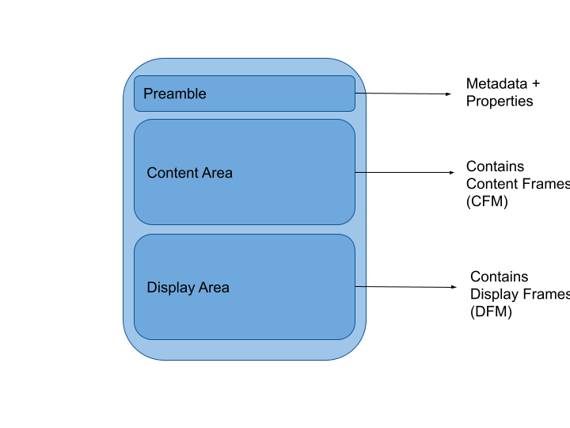

# ADF - Accessible Document Format # 

**Disclaimer** - This repository (i.e. currently this README) contains the draft of the specification for a new binary file format I've been thinking about from time to time for the last two years. Contrbutions are always welcome, just open an issue about the ideas or critics you have to open an discussion. 
ADF is a working title.

## Introduction

The idea of this new file format is to split a document into two main sections (plus metadata): The actual data (see fig. Layout, *Content Area*) and how-to-visualize this data (see fig. Layout, *Display Area*). If the data is kept structured and well-defined, this allows to parse data seamlessly similiar to JSON- or XML-files while it also allows for it to be as presentable as PDFs. I hope that everyone who has parsed a PDF, copied text from a PDF or have seen a bank emplyee transfering information from the companies information system into a PDF-template by hand agrees with me, that PDFs are an omnipresent but absurde file format for this era of technology we life in. 

Making the case for this file format one might imagine a typical employment contract. 

### Why not describe an extension for JSON and XML?

Generaly I am open to propositions making the case for this idea. From my point of view there exist a few great obstacels for this approach. 
**TODO: Is list correct,exhaustive?**

* Referencing data in content-json-part
  * Unique?
  * Efficient?
* Size of max. serializationable JSON/XML?
* Include videos/fotos/etc. into JSON/XML? 
* Binary
  *  Easier for parsing
  * Ability to use different encoding schemes (e.g. Text in ascii, utf-8,16,32; Video; Audio)
* Cumbersame to fit "display-idea" into JSON/XML definition?

## Structure of an ADF File

The following paragraph describes the three parts of an ADF file in detail. Every blob of data in a file is packed into so called frames. While the preample can be seen as a frame itself, both the content-area and the display-area represent a collection of frames. Similar to network protocol packets, a frame has a header and a payload (**Note** that a payload might also be a collection of frames). Among others the header contains:

*  a unique identifiert (on a per document basis )
* data describing the frame itself 

**TODO: Insert graphic for raw frame structure here.**

### Preamble

### Content Frame (CFM)

A CFM consists of (**TODO**)

#### Examples

##### Emplyoment Contract

##### Payment Abrechnung / Steuern

### Display Frame (DFM)

